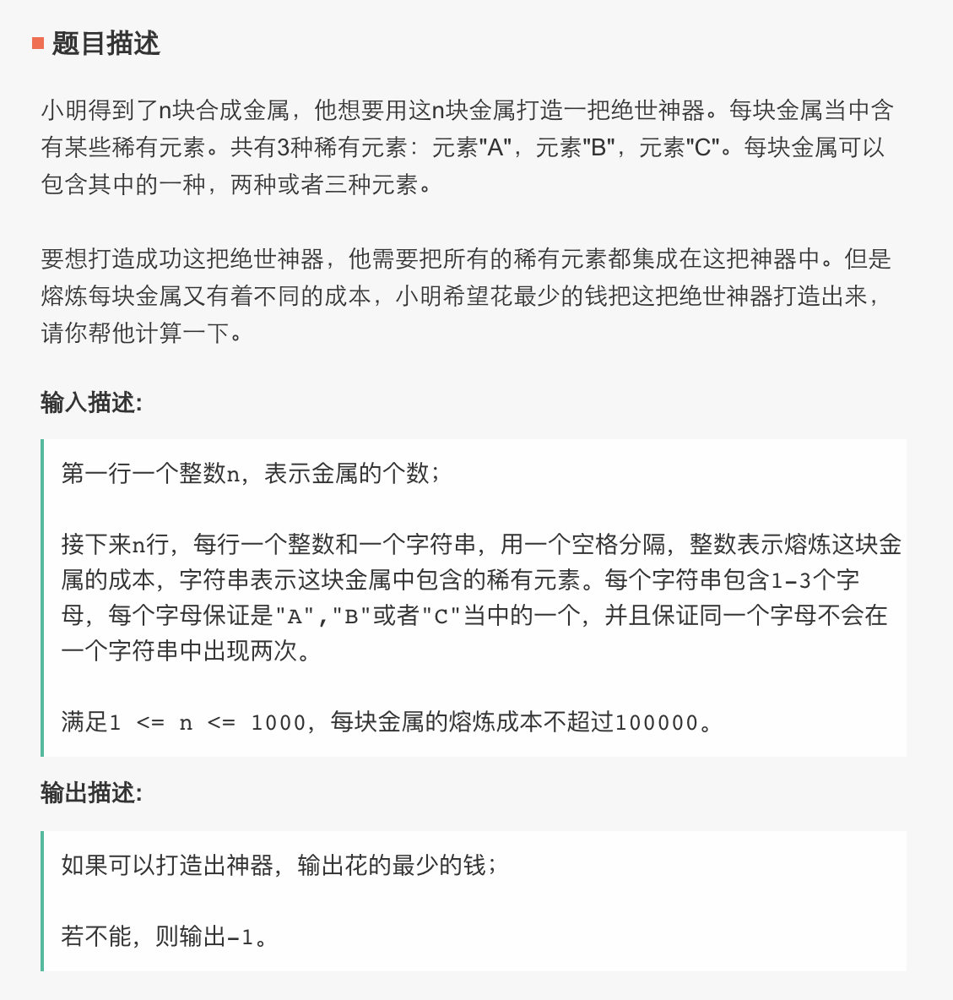
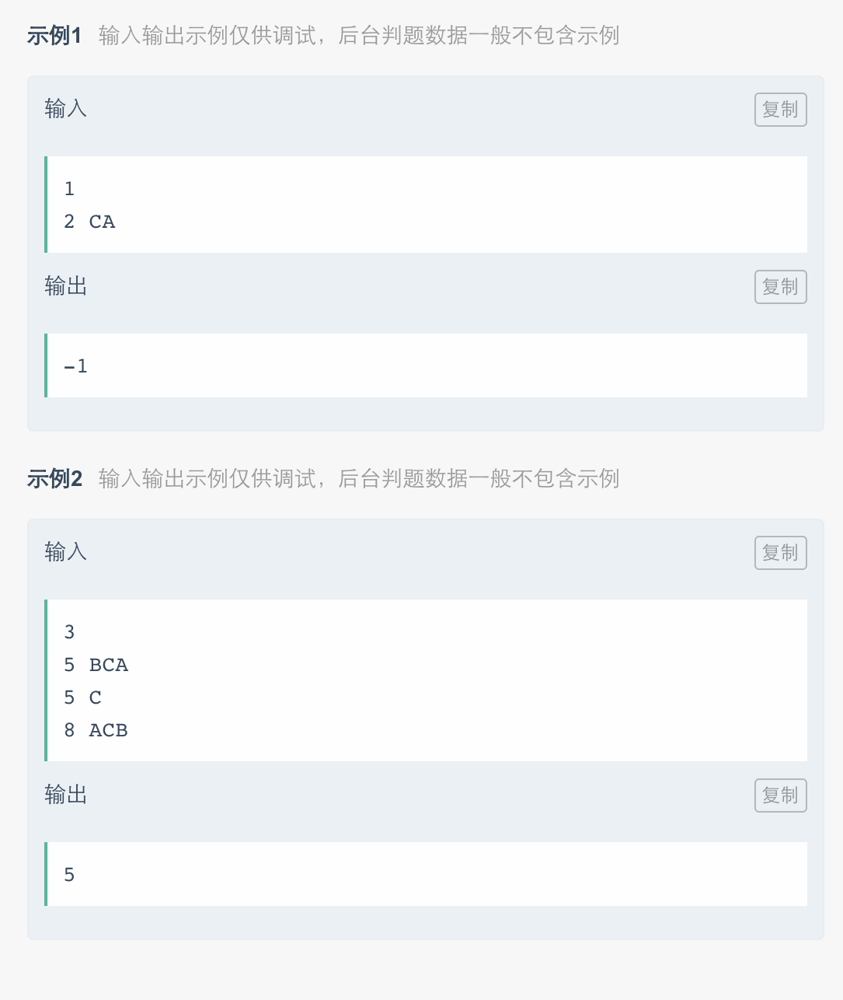

# Lowest Cost of Full 3 Character Combinaion

Given a series of input, find the lowest cost of combine different chunk into a full 3 characters.

There are `[1, 10000]` number of chunks, and the cost is `(0, 10000]`.

Input Description:
Input `String[] input1 = {"3", "5 BCA", "5 C", "8 ACB"}`. The first number `3` means there are three chunks.  
The number before a chucnk combination `5` means the cost to use this chunk.  
The Letters `BCA` means what's inside a chunk.

Example:

Input1:  
```
3
5 BCA
5 C
8 ACB
```
which is `{"3", "5 BCA", "5 C", "8 ACB"}`, return `5`.

Input 2:
```
1
2 CA
```
which is `{"1", "2 CA"}`, return -1;

Note:  
Each chunk contains 1 - 3 letters and there are no duplicates inside a chunk.

---
牛客网海归在线笔试编程题第二题。  
只会这种简单方法，单纯做出来就花了一个多小时。。。。  
真·一首凉凉送给自己。。。。  
  
  
